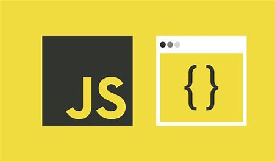

# 10-Mini-Javascript-Projects

---------------------------------------------------------------------------

#### JavaScript is very much essential for development phase so after inspiring from Akshay Saini Namaste JavaScript series.
#### I made 10 simple Mini JavaScript Projects that will purely logical and challenging one you can check out these projects from my GitHub repo and also can do it by yourself  #### I ensures it will cover-up your project-based learning with JavaScript.

 ##### And, also one request to show some love by sharing and commenting out so that it reach out to maximum number of people and hit large to developer community.
 
 
